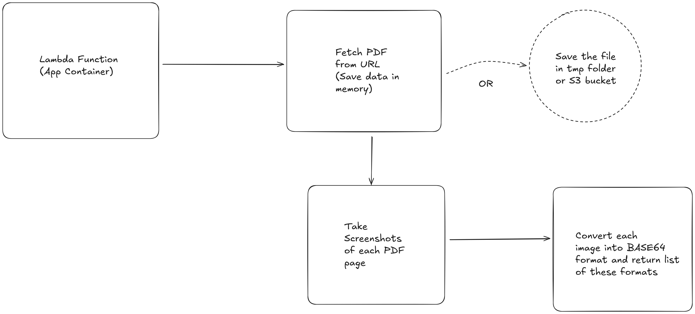

# Serverless PDF Extractor

This application is a lambda function that does the following steps
1. It takes a link containing the PDF file
2. It then extracts each page of this PDF, 
3. It takes the screenshot of each page of the PDF.
4. It converts the image into BASE64 encoded format for each page
5. It returns the list of these BASE64 images.

## Architecture Diagram

